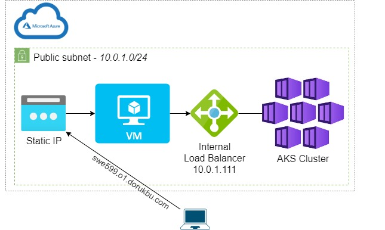

### TODO
- [x] Create Public IP (static) via GCP portal
- [x] Add Terraform directory to do the following:
  - Create a virtual machine (VM):
    - in a public subnet (will be shared with the k8s cluster).
    - w/ public ssh key found under ./swe599-o1/ssh_keys/ (Prequisite)
    - w/ the preexisting public IP obtained.
  - Set up a Kubernetes cluster within the same subnet as the VM
  - Other required & compementary components (e.g. Virtual Network, Service Principal role assignments, Network Security Group)
  - Output important information to be utilized in further steps (kubeconfig, public ip etc.)
- [x] Create a Type A DNS record for the public IP assigned to the vm
- [x] Add k8s directory to do the following:
  - Deploy a sample app from GKS tutorial
- [x] Add system architecture diagram to README
- [ ] Deploy Kubernetes cloud load balancer (internal lb) with custom internal IP (within the subnet CIDR block)
- [ ] Add Ansible directory to take care of provisioning the following tools:
  - Nginx for TLS termination and as a reverse proxy
  - net-tools, certbot
  - Create and setup a TLS certificate via certbot
  - Deploy a simple UI to interact with the kuberntes load balancer (Optional)
  - Grafana to monitor Kubernetes
  - JMeter to conduct tests
- [ ] Write kubernetes manifests:
  - Deploy LLM model w/ Prometheus sidecar to send logs & metrics to Grafana on VM
  - Prometheus node exporter
  - Internal load balancer (with private ip 10.0.1.111)
  - Prometheus sidecar 
- [ ] Create a Bash entrypoint script to:
  - Check if gcloud cli tool is installed -> prompt to install if not installed
  - Check if gke-gcloud-auth-plugin is installed
  - generate the SSH key pair in the directory ./swe599-o1/ssh_keys/
  - automate the processes of resource creation, provisioning, deployment, destruction
  - KUBECONFIG setup

#### Current DNS address for the virtual machine (VM)*
[http://swe599.o1.dorukbu.com](http://swe599.o1.dorukbu.com)
##### *DISCLAIMER: The system is shut down when it is not in operation to reduce cloud costs.

## Architecture Diagram


# How to Guide
Your folder structure should look something like this after step 2:
```
.
├── README.md
├── k8s
│   ├── azurek8s
│   └── manifests
│       └── aks-store-quickstart-internalip.yaml
├── ssh_keys
│   ├── id_rsa
│   └── id_rsa.pub
└── terraform
    ├── main.destroy.tfplan
    ├── main.tf
    ├── main.tfplan
    ├── outputs.tf
    ├── providers.tf
    ├── ssh.tf
    ├── terraform.tfstate
    ├── terraform.tfstate.backup
    └── variables.tf
```

## 0. Prerequisites

- **Public IP**: A Public IP address must be provisioned in the same region. Its name should match the value of `var.public_ip_name` (e.g., `public-ip-swe599-objective-1`).

- **RSA SSH Key Pair**: An RSA SSH key pair is required and must be placed under `./swe599-o1/ssh_keys/`.
## 0. GCP Setup
Check if you are logged in with Google Cloud Platform CLI tool
`gcloud auth list`

## 1. Terraform Commands

export TF_LOG=DEBUG

`terraform init -upgrade`

`terraform plan -out main.tfplan`

`terraform apply main.tfplan`

## 2. After Creation of Cloud Resources:

`gcloud container clusters get-credentials gke-cluster-swe599 --region=us-central1-a`

`kubectl config view`

`kubectl config current-context`

`kubectl apply -f ilb-deployment.yaml`

`kubectl apply -f ilb-svc.yaml`

`ssh -i id_rsa gcpadmin@swe599.dorukbu.com`

### 3. Destroy Everything

`kubectl delete -f gke-ilb-svc.yaml` -> Just in case

`kubectl delete -f gke-ilb-deployment.yaml` -> Just in case

`terraform plan -destroy -out main.destroy.tfplan`

`terraform apply main.destroy.tfplan`

### 4. Debugging

gcloud compute accelerator-types list --zones=us-central1-a

gcloud compute regions describe us-central1 --format="yaml(quotas)"

gcloud compute regions describe us-central1 --format="yaml(quotas)" | grep -i -C 1 nvidia_t4
=======
`terraform apply main.destroy.tfplan`

